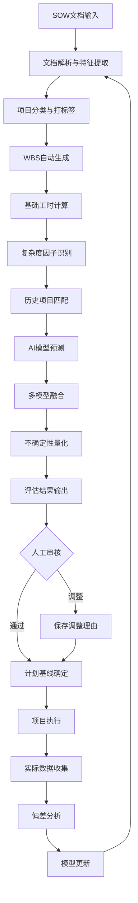

# 项目成本智能评估系统 - 工作量评估方法详细设计

## 文档信息
- **版本**: v1.0
- **创建日期**: 2025-10-13
- **目标**: 设计一套科学、可靠、可持续优化的项目工作量评估方法
- **适用范围**: 金融行业监管报送类项目

---

## 目录
1. [评估方法论框架](#1-评估方法论框架)
2. [多维度评估模型](#2-多维度评估模型)
3. [数据驱动的评估策略](#3-数据驱动的评估策略)
4. [AI/ML集成方案](#4-aiml集成方案)
5. [核心算法设计](#5-核心算法设计)
6. [复杂度因子体系](#6-复杂度因子体系)
7. [历史模式匹配](#7-历史模式匹配)
8. [不确定性管理](#8-不确定性管理)
9. [持续优化机制](#9-持续优化机制)
10. [实施路线图](#10-实施路线图)

---

## 1. 评估方法论框架

### 1.1 核心理念

**三层评估架构**:
```
┌─────────────────────────────────────────────┐
│  Layer 3: AI增强层                            │
│  - 大模型理解项目语义                          │
│  - 机器学习预测复杂度                          │
│  - 自然语言处理提取特征                         │
└─────────────────────────────────────────────┘
                    ↓
┌─────────────────────────────────────────────┐
│  Layer 2: 数据智能层                          │
│  - 历史项目相似度匹配                          │
│  - 统计模型偏差修正                            │
│  - 模式识别和经验萃取                          │
└─────────────────────────────────────────────┘
                    ↓
┌─────────────────────────────────────────────┐
│  Layer 1: 规则基础层                          │
│  - 标准工时定额                               │
│  - WBS模板化分解                              │
│  - 线性参数化计算                             │
└─────────────────────────────────────────────┘
```

**设计原则**:
1. **可解释性优先**: 所有评估结果必须可追溯、可解释
2. **渐进式准确**: 从规则基线开始,逐步引入AI增强
3. **人机协同**: AI提供建议,人工保留最终决策权
4. **持续学习**: 每个项目完成后反馈优化模型
5. **风险可控**: 提供评估区间而非单点值

### 1.2 评估流程设计



### 1.3 评估粒度体系

| 层级 | 粒度 | 评估单位 | 精度要求 | 适用阶段 |
|------|------|---------|---------|---------|
| L1 - 项目级 | 整体项目 | 人月 | ±30% | 商机阶段 |
| L2 - 阶段级 | 需求/开发/测试 | 人周 | ±20% | 售前阶段 |
| L3 - 任务包级 | WBS Level 2 | 人天 | ±15% | 项目启动 |
| L4 - 任务级 | WBS Level 3+ | 人时 | ±10% | 详细计划 |

**评估精度提升策略**:
- 商机阶段: 快速评估,基于项目类型和规模参数
- 售前阶段: 引入相似项目参考
- 项目启动: 详细WBS分解,AI辅助评估
- 执行过程: 实时调整,滚动预测

---

## 2. 多维度评估模型

### 2.1 核心评估维度

#### 2.1.1 规模维度 (Scale Factors)

**一级指标**:
```python
scale_factors = {
    "data_sources": {
        "name": "数据源系统数量",
        "unit": "个",
        "weight": 0.25,
        "base_hours_per_unit": 40,  # 每个数据源基础工时
        "sub_factors": {
            "system_complexity": [0.7, 1.0, 1.3],  # 简单/中等/复杂
            "data_quality": [0.8, 1.0, 1.2],       # 好/中/差
            "interface_type": {
                "database": 1.0,
                "file": 0.8,
                "api": 1.2,
                "mainframe": 1.5
            }
        }
    },

    "interface_tables": {
        "name": "接口表数量",
        "unit": "张",
        "weight": 0.30,
        "base_hours_per_unit": 8,  # 每张表基础工时
        "sub_factors": {
            "table_complexity": {
                "simple": 0.5,      # <10字段
                "medium": 1.0,      # 10-30字段
                "complex": 1.8,     # 30-50字段
                "very_complex": 2.5 # >50字段
            },
            "business_logic": [1.0, 1.3, 1.6, 2.0]  # 无/简单/中等/复杂
        }
    },

    "reports_forms": {
        "name": "报表报文数量",
        "unit": "个",
        "weight": 0.20,
        "base_hours_per_unit": 16,
        "sub_factors": {
            "report_type": {
                "standard": 0.8,
                "custom": 1.2,
                "complex_calculation": 1.5
            },
            "data_volume": [0.9, 1.0, 1.2, 1.4]  # 小/中/大/超大
        }
    },

    "custom_requirements": {
        "name": "个性化需求",
        "unit": "个",
        "weight": 0.15,
        "base_hours_per_unit": 24,
        "evaluation_method": "expert_judgment"  # 需要专家评估
    },

    "data_volume": {
        "name": "数据量级",
        "unit": "量级",
        "weight": 0.10,
        "multiplier": {
            "small": 0.9,      # <100万条
            "medium": 1.0,     # 100万-1000万
            "large": 1.15,     # 1000万-1亿
            "very_large": 1.3  # >1亿
        }
    }
}
```

#### 2.1.2 复杂度维度 (Complexity Factors)

```python
complexity_factors = {
    "technical_complexity": {
        "weight": 0.30,
        "metrics": {
            "technology_stack_maturity": {
                "mature": 0.9,       # 成熟技术栈
                "standard": 1.0,     # 标准技术栈
                "new": 1.3,          # 新技术
                "experimental": 1.6   # 实验性技术
            },
            "system_integration": {
                "standalone": 0.8,
                "few_integrations": 1.0,
                "multiple_integrations": 1.3,
                "complex_integration": 1.6
            },
            "data_transformation": {
                "simple_mapping": 0.7,
                "moderate_logic": 1.0,
                "complex_rules": 1.4,
                "advanced_algorithms": 1.8
            }
        }
    },

    "business_complexity": {
        "weight": 0.25,
        "metrics": {
            "regulatory_requirements": {
                "standard": 1.0,
                "strict": 1.3,
                "very_strict": 1.6
            },
            "business_logic": {
                "straightforward": 0.8,
                "moderate": 1.0,
                "complex": 1.4,
                "very_complex": 1.8
            },
            "stakeholder_count": {
                "single": 0.9,
                "few": 1.0,
                "many": 1.2,
                "multiple_organizations": 1.5
            }
        }
    },

    "data_complexity": {
        "weight": 0.20,
        "metrics": {
            "data_quality": {
                "high": 0.8,
                "medium": 1.0,
                "low": 1.4,
                "very_low": 1.8
            },
            "data_consistency": {
                "consistent": 0.9,
                "mostly_consistent": 1.0,
                "inconsistent": 1.3,
                "highly_inconsistent": 1.6
            },
            "historical_data_migration": {
                "none": 1.0,
                "partial": 1.2,
                "full": 1.5,
                "complex": 2.0
            }
        }
    },

    "organizational_complexity": {
        "weight": 0.15,
        "metrics": {
            "client_maturity": {
                "high": 0.8,
                "medium": 1.0,
                "low": 1.3
            },
            "communication_overhead": {
                "low": 0.9,
                "medium": 1.0,
                "high": 1.3
            },
            "approval_process": {
                "simple": 0.9,
                "standard": 1.0,
                "complex": 1.4
            }
        }
    },

    "risk_factors": {
        "weight": 0.10,
        "metrics": {
            "deadline_pressure": {
                "relaxed": 0.9,
                "normal": 1.0,
                "tight": 1.2,
                "very_tight": 1.5
            },
            "team_experience": {
                "expert": 0.8,
                "experienced": 0.9,
                "mixed": 1.0,
                "junior": 1.3
            }
        }
    }
}
```

### 2.2 WBS任务类型标准工时库

```python
task_type_baseline = {
    "project_management": {
        "project_kickoff": {
            "base_hours": 16,
            "description": "项目启动会、章程编制",
            "percentage_of_total": 0.02
        },
        "weekly_tracking": {
            "base_hours_per_week": 4,
            "description": "周会、周报、进度跟踪",
            "calculation": "project_duration_weeks * 4"
        },
        "milestone_review": {
            "base_hours_per_milestone": 8,
            "description": "里程碑评审会",
            "calculation": "milestone_count * 8"
        },
        "project_closure": {
            "base_hours": 24,
            "description": "项目收尾、总结、文档归档",
            "percentage_of_total": 0.03
        }
    },

    "requirement_analysis": {
        "business_research": {
            "base_hours": 40,
            "adjustment_by_scope": [0.7, 1.0, 1.5],  # 小/中/大
            "description": "业务调研、现状分析"
        },
        "requirement_interview": {
            "base_hours_per_source": 16,
            "description": "需求访谈",
            "calculation": "data_sources * 16"
        },
        "interface_design": {
            "base_hours_per_table": 2,
            "description": "接口表设计",
            "calculation": "interface_tables * 2"
        },
        "requirement_confirmation": {
            "base_hours": 24,
            "description": "需求文档编制与确认"
        }
    },

    "development": {
        "environment_setup": {
            "base_hours": 16,
            "description": "开发测试环境准备"
        },
        "etl_development": {
            "source_connection": {
                "base_hours_per_source": 8,
                "description": "数据源连接配置",
                "calculation": "data_sources * 8"
            },
            "data_extraction": {
                "base_hours_per_source": 24,
                "complexity_multiplier": [0.8, 1.0, 1.3, 1.6],
                "description": "数据提取逻辑开发",
                "calculation": "data_sources * 24 * complexity"
            },
            "data_transformation": {
                "base_hours_per_table": 6,
                "complexity_multiplier": [0.5, 1.0, 1.5, 2.0],
                "description": "数据清洗转换",
                "calculation": "interface_tables * 6 * complexity"
            },
            "data_loading": {
                "base_hours_per_table": 4,
                "description": "数据加载",
                "calculation": "interface_tables * 4"
            }
        },
        "product_configuration": {
            "base_hours": 40,
            "description": "产品参数配置、规则配置"
        },
        "custom_development": {
            "base_hours_per_requirement": 32,
            "complexity_multiplier": [0.8, 1.0, 1.5, 2.5],
            "description": "个性化功能开发",
            "calculation": "custom_requirements * 32 * complexity"
        },
        "report_development": {
            "base_hours_per_report": 12,
            "complexity_multiplier": [0.8, 1.0, 1.3, 1.6],
            "description": "报表报文开发",
            "calculation": "reports_count * 12 * complexity"
        }
    },

    "testing": {
        "unit_testing": {
            "base_percentage": 0.20,
            "description": "单元测试",
            "calculation": "development_hours * 0.20"
        },
        "sit_testing": {
            "base_hours_per_scenario": 8,
            "description": "系统集成测试",
            "calculation": "test_scenarios * 8"
        },
        "uat_testing": {
            "base_hours_per_case": 4,
            "support_ratio": 0.15,
            "description": "用户验收测试支持",
            "calculation": "uat_cases * 4 + development_hours * 0.15"
        },
        "trial_run_support": {
            "base_hours_per_month": 80,
            "description": "试运行支持",
            "calculation": "trial_months * 80"
        },
        "bug_fixing": {
            "base_percentage": 0.10,
            "description": "问题修复缓冲",
            "calculation": "total_dev_test_hours * 0.10"
        }
    },

    "training_delivery": {
        "user_training": {
            "base_hours_per_session": 16,
            "preparation_hours": 24,
            "description": "用户培训"
        },
        "documentation": {
            "base_hours": 40,
            "description": "项目文档编制"
        },
        "acceptance": {
            "base_hours": 16,
            "description": "项目验收准备"
        }
    }
}
```

---

## 3. 数据驱动的评估策略

### 3.1 历史数据结构化

#### 3.1.1 项目特征向量定义

```python
project_feature_vector = {
    # 基础属性
    "basic_info": {
        "project_type": "categorical",     # 监管报送类型
        "client_type": "categorical",      # 国有大行/股份制/城商行
        "project_scale": "ordinal",        # 小/中/大/特大
        "contract_amount": "numerical"     # 合同金额
    },

    # 规模指标
    "scale_metrics": {
        "data_sources_count": "numerical",
        "interface_tables_count": "numerical",
        "reports_count": "numerical",
        "custom_requirements_count": "numerical",
        "total_data_volume": "numerical"
    },

    # 复杂度指标
    "complexity_metrics": {
        "technical_complexity_score": "numerical",  # 0-10
        "business_complexity_score": "numerical",
        "data_complexity_score": "numerical",
        "organizational_complexity_score": "numerical"
    },

    # 团队指标
    "team_metrics": {
        "team_size": "numerical",
        "avg_experience_years": "numerical",
        "pm_experience_level": "ordinal"
    },

    # 时间指标
    "timeline_metrics": {
        "planned_duration_days": "numerical",
        "actual_duration_days": "numerical",
        "trial_period_months": "numerical"
    },

    # 成本指标
    "cost_metrics": {
        "planned_hours": "numerical",
        "actual_hours": "numerical",
        "variance_percentage": "numerical"
    },

    # 质量指标
    "quality_metrics": {
        "defect_count": "numerical",
        "rework_hours": "numerical",
        "client_satisfaction": "numerical"  # 1-5
    }
}
```

#### 3.1.2 数据采集清单

**必需数据** (MVP阶段):
- [ ] 项目基本信息 (30+ 项目)
- [ ] WBS结构和任务分解
- [ ] 计划工时 vs 实际工时
- [ ] 项目规模参数 (数据源、表、报表数量)
- [ ] 项目类型标签

**增强数据** (智能增强阶段):
- [ ] SOW原始文档
- [ ] 详细复杂度评估记录
- [ ] 问题和变更记录
- [ ] 里程碑达成记录
- [ ] 客户满意度评分

**高级数据** (数据智能阶段):
- [ ] 详细代码行数统计
- [ ] 测试用例覆盖率
- [ ] 团队成员技能矩阵
- [ ] 沟通记录和会议时长
- [ ] 风险日志

### 3.2 相似项目匹配算法

#### 3.2.1 多维相似度计算

```python
def calculate_project_similarity(target_project, historical_project):
    """
    计算项目相似度
    返回 0-1 之间的相似度分数
    """

    # 1. 分类特征相似度 (精确匹配)
    categorical_similarity = 0
    if target_project.project_type == historical_project.project_type:
        categorical_similarity += 0.4
    if target_project.client_type == historical_project.client_type:
        categorical_similarity += 0.1

    # 2. 规模相似度 (归一化欧氏距离)
    scale_features = ['data_sources', 'interface_tables', 'reports']
    scale_distance = 0
    for feature in scale_features:
        # 归一化到0-1范围
        normalized_diff = abs(
            target_project[feature] - historical_project[feature]
        ) / max(target_project[feature], historical_project[feature], 1)
        scale_distance += normalized_diff ** 2

    scale_similarity = 1 / (1 + sqrt(scale_distance))
    scale_score = scale_similarity * 0.3

    # 3. 复杂度相似度 (余弦相似度)
    complexity_vector_target = [
        target_project.technical_complexity,
        target_project.business_complexity,
        target_project.data_complexity
    ]
    complexity_vector_historical = [
        historical_project.technical_complexity,
        historical_project.business_complexity,
        historical_project.data_complexity
    ]

    complexity_similarity = cosine_similarity(
        complexity_vector_target,
        complexity_vector_historical
    )
    complexity_score = complexity_similarity * 0.2

    # 4. 综合相似度
    total_similarity = (
        categorical_similarity +
        scale_score +
        complexity_score
    )

    return total_similarity

def find_similar_projects(target_project, historical_projects, top_k=5):
    """
    查找最相似的K个历史项目
    """
    similarities = []

    for hist_proj in historical_projects:
        similarity = calculate_project_similarity(target_project, hist_proj)
        similarities.append({
            'project': hist_proj,
            'similarity': similarity,
            'actual_hours': hist_proj.actual_hours,
            'variance_rate': hist_proj.variance_percentage
        })

    # 按相似度排序
    similarities.sort(key=lambda x: x['similarity'], reverse=True)

    return similarities[:top_k]
```

#### 3.2.2 加权平均估算

```python
def estimate_from_similar_projects(target_project, similar_projects):
    """
    基于相似项目进行加权平均估算
    """

    # 相似度加权
    total_weight = sum(proj['similarity'] for proj in similar_projects)

    weighted_hours = sum(
        proj['actual_hours'] * proj['similarity']
        for proj in similar_projects
    ) / total_weight

    # 考虑历史偏差率
    avg_variance = sum(
        proj['variance_rate'] * proj['similarity']
        for proj in similar_projects
    ) / total_weight

    # 调整估算值
    adjusted_estimate = weighted_hours * (1 + avg_variance / 100)

    # 计算置信区间
    std_dev = calculate_std_dev([p['actual_hours'] for p in similar_projects])
    confidence_interval = (
        adjusted_estimate - 1.96 * std_dev,
        adjusted_estimate + 1.96 * std_dev
    )

    return {
        'estimate': adjusted_estimate,
        'confidence_interval': confidence_interval,
        'confidence_level': 0.95,
        'based_on_projects': len(similar_projects),
        'avg_similarity': total_weight / len(similar_projects)
    }
```

### 3.3 统计模型构建

#### 3.3.1 多元线性回归模型

```python
from sklearn.linear_model import LinearRegression
from sklearn.preprocessing import StandardScaler

def build_regression_model(historical_data):
    """
    构建线性回归模型预测工作量
    """

    # 特征工程
    features = [
        'data_sources_count',
        'interface_tables_count',
        'reports_count',
        'custom_requirements_count',
        'technical_complexity_score',
        'business_complexity_score',
        'data_complexity_score'
    ]

    X = historical_data[features]
    y = historical_data['actual_hours']

    # 标准化
    scaler = StandardScaler()
    X_scaled = scaler.fit_transform(X)

    # 训练模型
    model = LinearRegression()
    model.fit(X_scaled, y)

    # 模型评估
    r2_score = model.score(X_scaled, y)

    # 获取特征重要性
    feature_importance = dict(zip(features, model.coef_))

    return {
        'model': model,
        'scaler': scaler,
        'r2_score': r2_score,
        'feature_importance': feature_importance,
        'intercept': model.intercept_
    }

def predict_with_regression(model_obj, target_project):
    """
    使用回归模型进行预测
    """
    features = extract_features(target_project)
    features_scaled = model_obj['scaler'].transform([features])

    prediction = model_obj['model'].predict(features_scaled)[0]

    return prediction
```

#### 3.3.2 决策树/随机森林模型

```python
from sklearn.ensemble import RandomForestRegressor

def build_random_forest_model(historical_data):
    """
    构建随机森林模型,更好处理非线性关系
    """

    features = prepare_features(historical_data)
    X = historical_data[features]
    y = historical_data['actual_hours']

    # 随机森林模型
    rf_model = RandomForestRegressor(
        n_estimators=100,
        max_depth=10,
        min_samples_split=5,
        random_state=42
    )

    rf_model.fit(X, y)

    # 特征重要性
    feature_importance = dict(zip(features, rf_model.feature_importances_))

    return {
        'model': rf_model,
        'feature_importance': sorted(
            feature_importance.items(),
            key=lambda x: x[1],
            reverse=True
        )
    }
```

---

## 4. AI/ML集成方案

### 4.1 大模型集成策略

#### 4.1.1 Prompt工程设计

```python
estimation_prompt_template = """
你是一个资深的项目管理专家,专注于金融行业监管报送类项目的工作量评估。

# 角色定义
- 你有15年的项目管理经验
- 你熟悉银行核心系统、监管报送系统的技术架构
- 你擅长从SOW文档中提取关键信息并进行精准评估

# 任务
基于以下项目信息,进行工作量评估:

## 项目基本信息
- 项目名称: {project_name}
- 客户类型: {client_type}
- 监管报送类型: {regulation_type}

## 项目规模参数
- 数据源系统数量: {data_sources}个
- 接口表数量: {interface_tables}张
- 报表/报文数量: {reports}个
- 个性化需求: {custom_requirements}

## 技术环境
{technical_environment}

## 特殊要求
{special_requirements}

## 历史参考数据
相似项目1: {similar_project_1}
相似项目2: {similar_project_2}

# 输出要求
请以JSON格式输出评估结果:

{{
  "wbs_structure": [
    {{
      "phase": "需求分析",
      "tasks": [
        {{
          "task_name": "业务调研",
          "estimated_hours": 40,
          "reasoning": "考虑到X个数据源需要深入了解...",
          "complexity": "中",
          "risks": ["需求变更风险"]
        }},
        ...
      ]
    }},
    ...
  ],
  "total_estimate": {{
    "optimistic": 500,
    "most_likely": 650,
    "pessimistic": 850,
    "recommended": 650,
    "confidence_level": "中等"
  }},
  "key_assumptions": [
    "假设1: 数据质量良好,不需要大量清洗",
    "假设2: 客户能够及时配合需求访谈"
  ],
  "risk_factors": [
    {{
      "risk": "数据源接口文档不全",
      "impact": "高",
      "mitigation": "提前与客户IT部门沟通,获取详细文档",
      "contingency_hours": 40
    }}
  ],
  "recommendations": [
    "建议增加1周的需求调研时间",
    "建议安排有银行核心系统经验的开发人员"
  ]
}}

# 评估原则
1. 基于历史数据,但要考虑项目特殊性
2. 保守估算,留有缓冲
3. 明确说明假设条件
4. 识别潜在风险
5. 提供三点估算(乐观/最可能/悲观)
"""

def call_llm_for_estimation(project_info, similar_projects):
    """
    调用大模型进行智能评估
    """

    prompt = estimation_prompt_template.format(
        project_name=project_info['name'],
        client_type=project_info['client_type'],
        regulation_type=project_info['regulation_type'],
        data_sources=project_info['data_sources'],
        interface_tables=project_info['interface_tables'],
        reports=project_info['reports'],
        custom_requirements=project_info['custom_requirements'],
        technical_environment=project_info['tech_env'],
        special_requirements=project_info['special_req'],
        similar_project_1=format_project_reference(similar_projects[0]),
        similar_project_2=format_project_reference(similar_projects[1])
    )

    # 调用LLM API (OpenAI/Claude/etc.)
    response = llm_client.chat.completions.create(
        model="gpt-4",
        messages=[
            {"role": "system", "content": "你是项目评估专家"},
            {"role": "user", "content": prompt}
        ],
        temperature=0.3,  # 降低随机性,提高一致性
        max_tokens=2000
    )

    # 解析返回的JSON
    estimation_result = json.loads(response.choices[0].message.content)

    return estimation_result
```

#### 4.1.2 多模型融合策略

```python
def ensemble_estimation(project_info):
    """
    融合多个模型的预测结果
    """

    estimations = {}

    # 1. 规则基础估算
    rule_based = rule_based_estimation(project_info)
    estimations['rule_based'] = {
        'value': rule_based,
        'weight': 0.25,
        'confidence': 0.7
    }

    # 2. 相似项目估算
    similar_projects = find_similar_projects(project_info)
    similar_based = estimate_from_similar_projects(project_info, similar_projects)
    estimations['similarity_based'] = {
        'value': similar_based['estimate'],
        'weight': 0.25,
        'confidence': similar_based['avg_similarity']
    }

    # 3. 统计模型估算
    ml_prediction = predict_with_regression(ml_model, project_info)
    estimations['ml_based'] = {
        'value': ml_prediction,
        'weight': 0.20,
        'confidence': ml_model['r2_score']
    }

    # 4. 大模型估算
    llm_result = call_llm_for_estimation(project_info, similar_projects)
    estimations['llm_based'] = {
        'value': llm_result['total_estimate']['recommended'],
        'weight': 0.30,
        'confidence': 0.75
    }

    # 加权融合
    total_weight = sum(e['weight'] * e['confidence'] for e in estimations.values())
    final_estimate = sum(
        e['value'] * e['weight'] * e['confidence']
        for e in estimations.values()
    ) / total_weight

    # 计算分歧度 (各模型预测的标准差)
    values = [e['value'] for e in estimations.values()]
    disagreement = np.std(values) / np.mean(values)  # 变异系数

    return {
        'final_estimate': round(final_estimate, 1),
        'model_breakdown': estimations,
        'disagreement_score': disagreement,
        'confidence': 'high' if disagreement < 0.15 else 'medium' if disagreement < 0.25 else 'low',
        'llm_insights': llm_result
    }
```

### 4.2 文档解析与特征提取

#### 4.2.1 SOW文档智能解析

```python
sow_parsing_prompt = """
# 任务: SOW文档信息提取

请从以下SOW文档中提取关键项目信息:

## 文档内容
{sow_content}

## 提取要求
请以JSON格式输出:

{{
  "project_info": {{
    "project_name": "...",
    "client_name": "...",
    "regulation_type": "...",  # 如:1104报送、EAST系统等
    "project_duration": "X个月"
  }},

  "scope_metrics": {{
    "data_sources": [
      {{
        "name": "核心业务系统",
        "type": "database/file/api",
        "complexity": "简单/中等/复杂",
        "estimated_table_count": 10
      }},
      ...
    ],
    "interface_tables": {{
      "count": 50,
      "complexity_distribution": {{
        "simple": 20,
        "medium": 25,
        "complex": 5
      }}
    }},
    "reports": {{
      "count": 10,
      "types": ["standard", "custom"]
    }},
    "custom_requirements": [
      {{
        "description": "个性化数据校验规则",
        "complexity": "中",
        "estimated_hours": 40
      }}
    ]
  }},

  "technical_requirements": {{
    "technology_stack": ["Java", "Oracle", "ETL工具"],
    "integration_points": ["核心系统接口", "监管系统接口"],
    "performance_requirements": "..."
  }},

  "constraints": {{
    "timeline": "...",
    "budget": "...",
    "resources": "..."
  }},

  "risks_identified": [
    "数据质量风险",
    "接口稳定性风险"
  ]
}}

## 注意事项
1. 数量信息优先从表格中提取
2. 如果信息不明确,标注为"待确认"
3. 复杂度需要基于描述推断
4. 识别隐含需求和风险
"""

def parse_sow_document(sow_file_path):
    """
    解析SOW文档,提取结构化信息
    """

    # 读取文档内容
    if sow_file_path.endswith('.pdf'):
        content = extract_text_from_pdf(sow_file_path)
    elif sow_file_path.endswith('.docx'):
        content = extract_text_from_docx(sow_file_path)
    else:
        with open(sow_file_path, 'r') as f:
            content = f.read()

    # 调用LLM解析
    prompt = sow_parsing_prompt.format(sow_content=content)

    response = llm_client.chat.completions.create(
        model="gpt-4",
        messages=[
            {"role": "system", "content": "你是文档分析专家"},
            {"role": "user", "content": prompt}
        ],
        temperature=0.2
    )

    parsed_info = json.loads(response.choices[0].message.content)

    # 后处理和验证
    validated_info = validate_and_enrich(parsed_info)

    return validated_info
```

---

## 5. 核心算法设计

### 5.1 综合评估算法

```python
class WorkloadEstimator:
    """
    工作量评估器 - 核心算法实现
    """

    def __init__(self, historical_data, ml_models):
        self.historical_data = historical_data
        self.ml_models = ml_models
        self.task_baseline = task_type_baseline
        self.complexity_factors = complexity_factors

    def estimate(self, project_info):
        """
        主评估方法
        """

        # 步骤1: 生成WBS结构
        wbs = self.generate_wbs(project_info)

        # 步骤2: 计算基础工时
        base_hours = self.calculate_base_hours(wbs, project_info)

        # 步骤3: 应用复杂度调整
        adjusted_hours = self.apply_complexity_adjustment(base_hours, project_info)

        # 步骤4: 历史数据修正
        corrected_hours = self.apply_historical_correction(adjusted_hours, project_info)

        # 步骤5: 多模型融合
        final_estimate = self.ensemble_models(corrected_hours, project_info)

        # 步骤6: 生成详细评估报告
        report = self.generate_estimation_report(
            wbs, base_hours, adjusted_hours, corrected_hours, final_estimate
        )

        return report

    def generate_wbs(self, project_info):
        """
        智能生成WBS结构
        """
        wbs = []

        # 1. 项目管理 (10%)
        pm_phase = self.create_pm_phase(project_info)
        wbs.append(pm_phase)

        # 2. 需求分析 (15%)
        req_phase = self.create_requirement_phase(project_info)
        wbs.append(req_phase)

        # 3. 开发实施 (40%)
        dev_phase = self.create_development_phase(project_info)
        wbs.append(dev_phase)

        # 4. 测试验证 (25%)
        test_phase = self.create_testing_phase(project_info)
        wbs.append(test_phase)

        # 5. 培训交付 (10%)
        delivery_phase = self.create_delivery_phase(project_info)
        wbs.append(delivery_phase)

        return wbs

    def calculate_base_hours(self, wbs, project_info):
        """
        计算基础工时
        """
        total_hours = 0
        task_hours = {}

        for phase in wbs:
            phase_hours = 0
            for task in phase['tasks']:
                # 根据任务类型查找标准工时
                if task['type'] == 'per_source':
                    hours = (
                        task['base_hours_per_unit'] *
                        project_info['data_sources']
                    )
                elif task['type'] == 'per_table':
                    hours = (
                        task['base_hours_per_unit'] *
                        project_info['interface_tables']
                    )
                elif task['type'] == 'fixed':
                    hours = task['base_hours']
                elif task['type'] == 'percentage':
                    hours = total_hours * task['percentage']
                else:
                    hours = task['base_hours']

                task_hours[task['id']] = hours
                phase_hours += hours

            total_hours += phase_hours

        return {
            'total': total_hours,
            'by_phase': {phase['name']: sum(task_hours[t['id']] for t in phase['tasks']) for phase in wbs},
            'by_task': task_hours
        }

    def apply_complexity_adjustment(self, base_hours, project_info):
        """
        应用复杂度调整系数
        """

        # 计算综合复杂度系数
        complexity_score = self.calculate_complexity_score(project_info)

        # 复杂度系数映射
        # 0-3: 简单 (0.8-0.9)
        # 3-5: 中等 (0.9-1.1)
        # 5-7: 复杂 (1.1-1.4)
        # 7-10: 非常复杂 (1.4-2.0)

        if complexity_score < 3:
            multiplier = 0.8 + complexity_score * 0.033
        elif complexity_score < 5:
            multiplier = 0.9 + (complexity_score - 3) * 0.1
        elif complexity_score < 7:
            multiplier = 1.1 + (complexity_score - 5) * 0.15
        else:
            multiplier = 1.4 + (complexity_score - 7) * 0.2

        adjusted_hours = base_hours['total'] * multiplier

        return {
            'total': adjusted_hours,
            'complexity_score': complexity_score,
            'multiplier': multiplier,
            'base_hours': base_hours['total']
        }

    def apply_historical_correction(self, adjusted_hours, project_info):
        """
        基于历史数据修正
        """

        # 查找相似项目
        similar_projects = find_similar_projects(project_info, self.historical_data)

        if len(similar_projects) < 3:
            # 数据不足,不做修正
            return adjusted_hours

        # 计算历史平均偏差率
        avg_variance = np.mean([p['variance_rate'] for p in similar_projects])

        # 应用修正
        correction_factor = 1 + (avg_variance / 100)
        corrected_hours = adjusted_hours['total'] * correction_factor

        return {
            'total': corrected_hours,
            'correction_factor': correction_factor,
            'based_on_projects': len(similar_projects),
            'avg_historical_variance': avg_variance
        }

    def calculate_complexity_score(self, project_info):
        """
        计算综合复杂度分数 (0-10)
        """

        total_score = 0

        for category, factors in self.complexity_factors.items():
            category_score = 0
            category_weight = factors['weight']

            for metric, values in factors['metrics'].items():
                # 根据项目信息获取该指标的值
                metric_value = project_info.get(metric, 'standard')

                # 映射到0-10分数
                if isinstance(values, dict):
                    score_map = {
                        list(values.keys())[0]: 2,
                        list(values.keys())[1]: 5,
                        list(values.keys())[2]: 7,
                        list(values.keys())[3]: 9
                    }
                    metric_score = score_map.get(metric_value, 5)
                else:
                    metric_score = 5  # 默认中等

                category_score += metric_score

            # 标准化到0-10
            category_score = (category_score / len(factors['metrics'])) * category_weight * 10
            total_score += category_score

        return min(total_score, 10)  # 确保不超过10
```

### 5.2 三点估算算法

```python
def three_point_estimation(project_info):
    """
    PERT三点估算法
    """

    # 乐观估算 (假设一切顺利)
    optimistic = calculate_optimistic_estimate(project_info)

    # 最可能估算 (正常情况)
    most_likely = calculate_most_likely_estimate(project_info)

    # 悲观估算 (考虑各种风险)
    pessimistic = calculate_pessimistic_estimate(project_info)

    # PERT加权平均
    expected = (optimistic + 4 * most_likely + pessimistic) / 6

    # 标准差(衡量不确定性)
    std_dev = (pessimistic - optimistic) / 6

    # 置信区间
    confidence_68 = (expected - std_dev, expected + std_dev)
    confidence_95 = (expected - 2 * std_dev, expected + 2 * std_dev)

    return {
        'optimistic': optimistic,
        'most_likely': most_likely,
        'pessimistic': pessimistic,
        'expected': expected,
        'std_dev': std_dev,
        'confidence_68': confidence_68,  # 68%置信区间
        'confidence_95': confidence_95,  # 95%置信区间
        'risk_level': 'high' if std_dev / expected > 0.2 else 'medium' if std_dev / expected > 0.1 else 'low'
    }

def calculate_optimistic_estimate(project_info):
    """
    乐观估算: 理想情况
    - 团队经验丰富
    - 需求清晰稳定
    - 技术成熟
    - 无重大风险
    """
    base = calculate_base_estimate(project_info)
    # 减少20-30%
    return base * 0.75

def calculate_pessimistic_estimate(project_info):
    """
    悲观估算: 考虑风险
    - 需求变更
    - 技术难题
    - 资源问题
    - 客户延误
    """
    base = calculate_base_estimate(project_info)

    # 识别风险因子
    risk_factors = identify_risk_factors(project_info)
    risk_multiplier = 1.0

    for risk in risk_factors:
        risk_multiplier *= (1 + risk['impact'] * risk['probability'])

    # 增加30-80%
    return base * min(risk_multiplier, 1.8)
```

---

## 6. 复杂度因子体系

### 6.1 复杂度评估框架

```python
complexity_assessment_framework = {
    "dimensions": [
        {
            "name": "技术复杂度",
            "weight": 0.30,
            "sub_dimensions": [
                {
                    "name": "技术栈成熟度",
                    "questions": [
                        {
                            "q": "使用的技术栈是否成熟?",
                            "options": {
                                "成熟稳定(>5年)": 1,
                                "较成熟(2-5年)": 3,
                                "较新(<2年)": 6,
                                "实验性/自研": 9
                            }
                        },
                        {
                            "q": "团队对技术栈的熟悉程度?",
                            "options": {
                                "非常熟悉(>5个项目)": 1,
                                "熟悉(2-5个项目)": 3,
                                "了解(1个项目)": 6,
                                "不熟悉(0个项目)": 9
                            }
                        }
                    ]
                },
                {
                    "name": "系统集成复杂度",
                    "questions": [
                        {
                            "q": "需要集成几个外部系统?",
                            "options": {
                                "0-2个": 2,
                                "3-5个": 5,
                                "6-10个": 7,
                                ">10个": 9
                            }
                        },
                        {
                            "q": "集成接口的标准化程度?",
                            "options": {
                                "标准化接口(REST/SOAP)": 2,
                                "定制接口但文档完善": 5,
                                "定制接口文档不全": 7,
                                "无文档需要逆向": 9
                            }
                        }
                    ]
                },
                {
                    "name": "数据处理复杂度",
                    "questions": [
                        {
                            "q": "数据转换逻辑复杂度?",
                            "options": {
                                "简单映射": 1,
                                "包含计算和聚合": 4,
                                "复杂业务规则": 7,
                                "机器学习/高级算法": 9
                            }
                        },
                        {
                            "q": "数据量级?",
                            "options": {
                                "<100万条": 1,
                                "100万-1000万": 3,
                                "1000万-1亿": 6,
                                ">1亿": 8
                            }
                        }
                    ]
                }
            ]
        },
        {
            "name": "业务复杂度",
            "weight": 0.25,
            "sub_dimensions": [
                {
                    "name": "业务逻辑复杂度",
                    "questions": [
                        {
                            "q": "业务规则数量?",
                            "options": {
                                "<20条": 2,
                                "20-50条": 5,
                                "50-100条": 7,
                                ">100条": 9
                            }
                        },
                        {
                            "q": "业务规则之间的依赖关系?",
                            "options": {
                                "独立规则": 2,
                                "少量依赖": 5,
                                "复杂依赖": 8,
                                "循环依赖": 10
                            }
                        }
                    ]
                },
                {
                    "name": "监管要求复杂度",
                    "questions": [
                        {
                            "q": "监管规则的清晰度?",
                            "options": {
                                "规则明确,标准化": 2,
                                "规则较清晰": 5,
                                "规则模糊,需要澄清": 7,
                                "规则频繁变化": 9
                            }
                        },
                        {
                            "q": "数据质量要求?",
                            "options": {
                                "一般要求": 2,
                                "较高要求": 5,
                                "严格要求": 8,
                                "极其严格(金融级)": 10
                            }
                        }
                    ]
                }
            ]
        },
        {
            "name": "数据复杂度",
            "weight": 0.20,
            "sub_dimensions": [
                {
                    "name": "数据质量",
                    "questions": [
                        {
                            "q": "源数据质量如何?",
                            "options": {
                                "质量好,规范": 2,
                                "质量一般": 5,
                                "质量差,需大量清洗": 8,
                                "质量很差,数据缺失严重": 10
                            }
                        },
                        {
                            "q": "数据一致性?",
                            "options": {
                                "一致性好": 2,
                                "偶尔不一致": 5,
                                "经常不一致": 8,
                                "严重不一致": 10
                            }
                        }
                    ]
                },
                {
                    "name": "历史数据迁移",
                    "questions": [
                        {
                            "q": "是否需要迁移历史数据?",
                            "options": {
                                "不需要": 0,
                                "少量迁移(<1年)": 3,
                                "中量迁移(1-3年)": 6,
                                "大量迁移(>3年)": 9
                            }
                        }
                    ]
                }
            ]
        },
        {
            "name": "组织复杂度",
            "weight": 0.15,
            "sub_dimensions": [
                {
                    "name": "客户成熟度",
                    "questions": [
                        {
                            "q": "客户对类似项目的经验?",
                            "options": {
                                "经验丰富": 2,
                                "有一定经验": 5,
                                "经验较少": 7,
                                "首次实施": 9
                            }
                        },
                        {
                            "q": "客户决策效率?",
                            "options": {
                                "高效(1周内)": 2,
                                "正常(2-3周)": 5,
                                "较慢(4-6周)": 7,
                                "很慢(>6周)": 9
                            }
                        }
                    ]
                },
                {
                    "name": "沟通协调",
                    "questions": [
                        {
                            "q": "涉及的干系人数量?",
                            "options": {
                                "<5人": 2,
                                "5-10人": 5,
                                "10-20人": 7,
                                ">20人": 9
                            }
                        },
                        {
                            "q": "是否跨多个部门/组织?",
                            "options": {
                                "单一部门": 2,
                                "2-3个部门": 5,
                                "4-5个部门": 7,
                                ">5个部门或跨组织": 9
                            }
                        }
                    ]
                }
            ]
        },
        {
            "name": "风险因素",
            "weight": 0.10,
            "sub_dimensions": [
                {
                    "name": "时间压力",
                    "questions": [
                        {
                            "q": "项目时间压力?",
                            "options": {
                                "宽松(缓冲>30%)": 2,
                                "正常(缓冲15-30%)": 5,
                                "紧张(缓冲<15%)": 8,
                                "非常紧张(无缓冲)": 10
                            }
                        }
                    ]
                },
                {
                    "name": "团队稳定性",
                    "questions": [
                        {
                            "q": "团队成员稳定性?",
                            "options": {
                                "非常稳定(固定团队)": 2,
                                "稳定(偶尔调整)": 5,
                                "不稳定(频繁变动)": 8,
                                "非常不稳定(外包/临时)": 10
                            }
                        }
                    ]
                }
            ]
        }
    ]
}

def assess_complexity_interactive(project_info):
    """
    交互式复杂度评估
    通过问卷形式收集信息
    """
    scores = {}

    for dimension in complexity_assessment_framework['dimensions']:
        dimension_score = 0
        dimension_weight = dimension['weight']

        print(f"\n{'='*50}")
        print(f"评估维度: {dimension['name']}")
        print(f"{'='*50}")

        for sub_dim in dimension['sub_dimensions']:
            print(f"\n{sub_dim['name']}:")

            for question in sub_dim['questions']:
                print(f"\n  {question['q']}")
                for i, (option, score) in enumerate(question['options'].items(), 1):
                    print(f"    {i}. {option} (分数: {score})")

                # 获取用户输入
                choice = input("  请选择 (1-4): ")
                selected_score = list(question['options'].values())[int(choice)-1]

                dimension_score += selected_score

        # 标准化分数到0-10
        max_possible = sum(
            max(q['options'].values())
            for sub_dim in dimension['sub_dimensions']
            for q in sub_dim['questions']
        )
        normalized_score = (dimension_score / max_possible) * 10

        scores[dimension['name']] = {
            'raw_score': dimension_score,
            'normalized_score': normalized_score,
            'weight': dimension_weight,
            'weighted_score': normalized_score * dimension_weight
        }

    # 计算总分
    total_complexity = sum(s['weighted_score'] for s in scores.values())

    # 复杂度等级
    if total_complexity < 3:
        complexity_level = "简单"
        multiplier_range = (0.8, 0.9)
    elif total_complexity < 5:
        complexity_level = "中等"
        multiplier_range = (0.9, 1.1)
    elif total_complexity < 7:
        complexity_level = "复杂"
        multiplier_range = (1.1, 1.4)
    else:
        complexity_level = "非常复杂"
        multiplier_range = (1.4, 2.0)

    return {
        'total_score': total_complexity,
        'complexity_level': complexity_level,
        'multiplier_range': multiplier_range,
        'dimension_scores': scores,
        'recommendations': generate_complexity_recommendations(scores)
    }
```

### 6.2 自动复杂度识别

```python
def auto_detect_complexity(project_info, sow_content):
    """
    基于项目信息和SOW内容自动识别复杂度
    """

    complexity_indicators = {
        "technical": {
            "high_complexity_keywords": [
                "实时处理", "大数据", "机器学习", "分布式",
                "高并发", "微服务", "区块链"
            ],
            "integration_count": project_info.get('data_sources', 0),
            "custom_dev_ratio": project_info.get('custom_requirements', 0) / max(project_info.get('total_requirements', 1), 1)
        },
        "business": {
            "regulation_keywords": [
                "监管报送", "合规", "风险管理", "反洗钱", "IFRS9"
            ],
            "rule_complexity_indicators": [
                "复杂计算", "多维度分析", "交叉校验", "历史对比"
            ]
        },
        "data": {
            "volume_indicator": project_info.get('data_volume', 0),
            "quality_keywords": ["数据清洗", "数据治理", "数据质量", "数据标准化"],
            "source_count": project_info.get('data_sources', 0)
        }
    }

    # 基于关键词识别
    sow_lower = sow_content.lower()

    technical_score = 0
    for keyword in complexity_indicators['technical']['high_complexity_keywords']:
        if keyword in sow_lower:
            technical_score += 2

    # 基于数量指标
    if complexity_indicators['technical']['integration_count'] > 5:
        technical_score += 3

    # ... 更多规则

    return {
        'technical_complexity': min(technical_score, 10),
        'business_complexity': 5,  # 待实现
        'data_complexity': 5,       # 待实现
        'confidence': 0.7           # 自动识别置信度
    }
```

---

## 7. 历史模式匹配

### 7.1 项目聚类分析

```python
from sklearn.cluster import KMeans
from sklearn.preprocessing import StandardScaler

def cluster_historical_projects(historical_data):
    """
    对历史项目进行聚类,识别典型模式
    """

    # 特征选择
    features = [
        'data_sources', 'interface_tables', 'reports_count',
        'technical_complexity', 'business_complexity',
        'actual_hours', 'team_size'
    ]

    X = historical_data[features]

    # 标准化
    scaler = StandardScaler()
    X_scaled = scaler.fit_transform(X)

    # 聚类 (假设分5类)
    kmeans = KMeans(n_clusters=5, random_state=42)
    clusters = kmeans.fit_predict(X_scaled)

    # 为每个聚类命名
    cluster_names = {
        0: "小型简单项目",
        1: "中型标准项目",
        2: "大型复杂项目",
        3: "高技术难度项目",
        4: "高业务复杂度项目"
    }

    # 计算每个聚类的特征
    cluster_profiles = {}
    for i in range(5):
        cluster_data = historical_data[clusters == i]
        cluster_profiles[cluster_names[i]] = {
            'count': len(cluster_data),
            'avg_hours': cluster_data['actual_hours'].mean(),
            'std_hours': cluster_data['actual_hours'].std(),
            'avg_variance': cluster_data['variance_percentage'].mean(),
            'typical_features': {
                'data_sources': cluster_data['data_sources'].median(),
                'interface_tables': cluster_data['interface_tables'].median(),
                'reports': cluster_data['reports_count'].median()
            },
            'sample_projects': cluster_data['project_name'].head(3).tolist()
        }

    return {
        'model': kmeans,
        'scaler': scaler,
        'cluster_profiles': cluster_profiles
    }

def classify_new_project(project_info, clustering_model):
    """
    将新项目分类到某个聚类
    """
    features = extract_features(project_info)
    features_scaled = clustering_model['scaler'].transform([features])

    cluster_id = clustering_model['model'].predict(features_scaled)[0]
    cluster_name = list(clustering_model['cluster_profiles'].keys())[cluster_id]
    cluster_profile = clustering_model['cluster_profiles'][cluster_name]

    return {
        'cluster': cluster_name,
        'profile': cluster_profile,
        'reference_hours': cluster_profile['avg_hours'],
        'expected_variance': cluster_profile['avg_variance']
    }
```

### 7.2 案例推理 (CBR)

```python
class CaseBasedReasoning:
    """
    基于案例的推理系统
    """

    def __init__(self, case_library):
        self.case_library = case_library

    def retrieve_similar_cases(self, target_project, k=5):
        """
        检索相似案例
        """
        similarities = []

        for case in self.case_library:
            similarity = self.calculate_similarity(target_project, case)
            similarities.append({
                'case': case,
                'similarity': similarity
            })

        # 排序并返回Top-K
        similarities.sort(key=lambda x: x['similarity'], reverse=True)
        return similarities[:k]

    def reuse_case(self, target_project, similar_cases):
        """
        重用案例进行评估
        """
        # 加权平均
        total_weight = sum(c['similarity'] for c in similar_cases)

        estimated_hours = sum(
            c['case']['actual_hours'] * c['similarity']
            for c in similar_cases
        ) / total_weight

        # 调整案例
        adjustment_factors = self.identify_adjustment_factors(
            target_project, similar_cases[0]['case']
        )

        adjusted_hours = estimated_hours
        for factor, impact in adjustment_factors.items():
            adjusted_hours *= impact

        return {
            'estimated_hours': adjusted_hours,
            'base_estimate': estimated_hours,
            'adjustment_factors': adjustment_factors,
            'confidence': similar_cases[0]['similarity']
        }

    def revise_estimate(self, initial_estimate, expert_feedback):
        """
        根据专家反馈修正评估
        """
        revised_estimate = initial_estimate * (1 + expert_feedback['adjustment_ratio'])

        return {
            'initial': initial_estimate,
            'revised': revised_estimate,
            'reasoning': expert_feedback['reasoning']
        }

    def retain_new_case(self, project_case):
        """
        保留新案例到案例库
        """
        self.case_library.append(project_case)

        # 定期清理: 删除相似度过高的冗余案例
        self.case_library = self.remove_redundant_cases(self.case_library)

    def identify_adjustment_factors(self, target, reference):
        """
        识别需要调整的因素
        """
        factors = {}

        # 规模差异
        if target['data_sources'] > reference['data_sources']:
            scale_ratio = target['data_sources'] / reference['data_sources']
            factors['scale'] = 1.0 + (scale_ratio - 1) * 0.5  # 非线性增长

        # 复杂度差异
        if target['complexity_score'] > reference['complexity_score']:
            complexity_diff = target['complexity_score'] - reference['complexity_score']
            factors['complexity'] = 1.0 + complexity_diff * 0.05

        # 团队经验差异
        if target['team_experience'] < reference['team_experience']:
            factors['team'] = 1.2  # 经验不足增加20%

        return factors
```

---

## 8. 不确定性管理

### 8.1 蒙特卡洛模拟

```python
import numpy as np

def monte_carlo_simulation(project_info, n_simulations=10000):
    """
    蒙特卡洛模拟评估不确定性
    """

    # 为每个任务定义概率分布
    task_distributions = define_task_distributions(project_info)

    simulation_results = []

    for _ in range(n_simulations):
        total_hours = 0

        for task, distribution in task_distributions.items():
            # 从分布中采样
            if distribution['type'] == 'triangular':
                hours = np.random.triangular(
                    distribution['min'],
                    distribution['mode'],
                    distribution['max']
                )
            elif distribution['type'] == 'normal':
                hours = np.random.normal(
                    distribution['mean'],
                    distribution['std']
                )
            elif distribution['type'] == 'pert':
                # PERT分布 (Beta分布的特例)
                hours = pert_distribution(
                    distribution['optimistic'],
                    distribution['most_likely'],
                    distribution['pessimistic']
                )

            total_hours += hours

        simulation_results.append(total_hours)

    # 统计分析
    results_array = np.array(simulation_results)

    return {
        'mean': np.mean(results_array),
        'median': np.median(results_array),
        'std': np.std(results_array),
        'min': np.min(results_array),
        'max': np.max(results_array),
        'percentiles': {
            '10th': np.percentile(results_array, 10),
            '25th': np.percentile(results_array, 25),
            '50th': np.percentile(results_array, 50),
            '75th': np.percentile(results_array, 75),
            '90th': np.percentile(results_array, 90),
            '95th': np.percentile(results_array, 95)
        },
        'probability_distribution': np.histogram(results_array, bins=50)
    }

def pert_distribution(optimistic, most_likely, pessimistic, lambda_=4):
    """
    PERT分布采样
    """
    mean = (optimistic + lambda_ * most_likely + pessimistic) / (lambda_ + 2)

    # 使用Beta分布近似
    a = 1 + lambda_ * (mean - optimistic) / (pessimistic - optimistic)
    b = 1 + lambda_ * (pessimistic - mean) / (pessimistic - optimistic)

    beta_sample = np.random.beta(a, b)
    return optimistic + beta_sample * (pessimistic - optimistic)
```

### 8.2 风险缓冲计算

```python
def calculate_risk_buffer(project_estimate, risk_profile):
    """
    计算风险缓冲
    """

    base_estimate = project_estimate['total_hours']

    # 识别风险因素
    risks = risk_profile['identified_risks']

    total_risk_impact = 0

    for risk in risks:
        # 风险影响 = 概率 × 影响度 × 额外工时
        probability = risk['probability']  # 0-1
        impact = risk['impact_hours']      # 小时数

        expected_impact = probability * impact
        total_risk_impact += expected_impact

    # 项目复杂度缓冲
    complexity_score = project_estimate.get('complexity_score', 5)
    if complexity_score < 3:
        complexity_buffer = 0.05  # 5%
    elif complexity_score < 5:
        complexity_buffer = 0.10  # 10%
    elif complexity_score < 7:
        complexity_buffer = 0.15  # 15%
    else:
        complexity_buffer = 0.20  # 20%

    # 历史偏差缓冲
    historical_variance = project_estimate.get('avg_historical_variance', 0)
    variance_buffer = max(historical_variance / 100, 0)

    # 总缓冲
    risk_hours = total_risk_impact
    complexity_hours = base_estimate * complexity_buffer
    variance_hours = base_estimate * variance_buffer

    total_buffer = risk_hours + complexity_hours + variance_hours

    # 缓冲上限 (不超过基础估算的40%)
    total_buffer = min(total_buffer, base_estimate * 0.4)

    return {
        'base_estimate': base_estimate,
        'risk_buffer': risk_hours,
        'complexity_buffer': complexity_hours,
        'variance_buffer': variance_hours,
        'total_buffer': total_buffer,
        'final_estimate': base_estimate + total_buffer,
        'buffer_percentage': (total_buffer / base_estimate) * 100
    }
```

### 8.3 置信度评分

```python
def calculate_confidence_score(estimation_context):
    """
    计算评估置信度
    """

    confidence_factors = {
        'data_quality': {
            'weight': 0.25,
            'score': assess_data_quality(estimation_context)
        },
        'model_agreement': {
            'weight': 0.20,
            'score': assess_model_agreement(estimation_context)
        },
        'historical_similarity': {
            'weight': 0.20,
            'score': assess_historical_similarity(estimation_context)
        },
        'requirement_clarity': {
            'weight': 0.15,
            'score': assess_requirement_clarity(estimation_context)
        },
        'expert_validation': {
            'weight': 0.10,
            'score': assess_expert_validation(estimation_context)
        },
        'team_experience': {
            'weight': 0.10,
            'score': assess_team_experience(estimation_context)
        }
    }

    # 加权平均
    total_score = sum(
        factor['score'] * factor['weight']
        for factor in confidence_factors.values()
    )

    # 映射到置信等级
    if total_score >= 0.8:
        confidence_level = "高"
        recommended_buffer = "10-15%"
    elif total_score >= 0.6:
        confidence_level = "中"
        recommended_buffer = "15-25%"
    else:
        confidence_level = "低"
        recommended_buffer = "25-40%"

    return {
        'overall_confidence': total_score,
        'confidence_level': confidence_level,
        'recommended_buffer': recommended_buffer,
        'factor_breakdown': confidence_factors,
        'recommendations': generate_confidence_recommendations(confidence_factors)
    }

def assess_data_quality(context):
    """
    评估数据质量对置信度的影响
    """
    # 历史数据数量
    if context['historical_projects_count'] < 10:
        quantity_score = 0.3
    elif context['historical_projects_count'] < 30:
        quantity_score = 0.7
    else:
        quantity_score = 1.0

    # 数据完整性
    completeness_score = context['data_completeness']  # 0-1

    # 数据相关性
    relevance_score = context['data_relevance']  # 0-1

    return (quantity_score + completeness_score + relevance_score) / 3
```

---

## 9. 持续优化机制

### 9.1 反馈循环设计

```python
class EstimationFeedbackLoop:
    """
    评估反馈与优化系统
    """

    def __init__(self):
        self.model_performance_history = []

    def collect_project_actuals(self, project_id):
        """
        收集项目实际数据
        """
        project = get_project(project_id)

        actuals = {
            'project_id': project_id,
            'actual_hours': calculate_actual_hours(project),
            'actual_duration': calculate_duration(project),
            'actual_cost': calculate_cost(project),
            'quality_metrics': get_quality_metrics(project),
            'issues_encountered': get_issues(project)
        }

        return actuals

    def calculate_estimation_accuracy(self, project_id):
        """
        计算评估准确度
        """
        project = get_project(project_id)

        planned = project.baseline_estimate
        actual = self.collect_project_actuals(project_id)['actual_hours']

        # 偏差率
        variance = ((actual - planned) / planned) * 100

        # 绝对偏差率
        absolute_variance = abs(variance)

        # 准确度评级
        if absolute_variance < 10:
            accuracy_rating = "优秀"
        elif absolute_variance < 15:
            accuracy_rating = "良好"
        elif absolute_variance < 25:
            accuracy_rating = "一般"
        else:
            accuracy_rating = "较差"

        return {
            'planned_hours': planned,
            'actual_hours': actual,
            'variance_percentage': variance,
            'absolute_variance': absolute_variance,
            'accuracy_rating': accuracy_rating
        }

    def analyze_estimation_errors(self, project_id):
        """
        分析评估误差的根本原因
        """
        project = get_project(project_id)
        accuracy = self.calculate_estimation_accuracy(project_id)

        if abs(accuracy['variance_percentage']) < 10:
            return {'status': 'accurate', 'actions': []}

        # 分析误差来源
        error_sources = []

        # 1. 按阶段分析
        phase_variances = {}
        for phase in project.phases:
            phase_planned = sum(t.planned_hours for t in phase.tasks)
            phase_actual = sum(t.actual_hours for t in phase.tasks)
            phase_variance = ((phase_actual - phase_planned) / phase_planned) * 100

            if abs(phase_variance) > 20:
                phase_variances[phase.name] = phase_variance
                error_sources.append({
                    'type': 'phase_overrun',
                    'phase': phase.name,
                    'variance': phase_variance
                })

        # 2. 按任务类型分析
        task_type_variances = analyze_by_task_type(project)
        for task_type, variance in task_type_variances.items():
            if abs(variance) > 25:
                error_sources.append({
                    'type': 'task_type_error',
                    'task_type': task_type,
                    'variance': variance
                })

        # 3. 识别意外工作
        unplanned_work = identify_unplanned_work(project)
        if unplanned_work['hours'] > planned * 0.1:
            error_sources.append({
                'type': 'scope_creep',
                'unplanned_hours': unplanned_work['hours'],
                'reasons': unplanned_work['reasons']
            })

        # 4. 复杂度评估偏差
        estimated_complexity = project.baseline_complexity_score
        actual_complexity = assess_actual_complexity(project)
        if abs(estimated_complexity - actual_complexity) > 2:
            error_sources.append({
                'type': 'complexity_misjudgment',
                'estimated': estimated_complexity,
                'actual': actual_complexity
            })

        return {
            'error_sources': error_sources,
            'corrective_actions': generate_corrective_actions(error_sources)
        }

    def update_estimation_models(self, completed_projects):
        """
        更新评估模型
        """
        # 收集最近完成项目的数据
        training_data = []
        for project_id in completed_projects:
            project_data = {
                'features': extract_project_features(project_id),
                'actual_hours': self.collect_project_actuals(project_id)['actual_hours'],
                'complexity_score': assess_actual_complexity(get_project(project_id))
            }
            training_data.append(project_data)

        # 重新训练模型
        updated_models = retrain_models(training_data)

        # A/B测试验证
        validation_results = validate_models(updated_models, validation_set)

        if validation_results['improvement'] > 0.05:  # 提升超过5%
            deploy_updated_models(updated_models)
            return {
                'status': 'updated',
                'improvement': validation_results['improvement'],
                'new_accuracy': validation_results['accuracy']
            }
        else:
            return {
                'status': 'no_update',
                'reason': 'improvement_insufficient'
            }

    def adjust_baseline_parameters(self, analysis_results):
        """
        调整基线参数
        """
        # 识别系统性偏差
        systematic_bias = calculate_systematic_bias(analysis_results)

        if abs(systematic_bias) > 0.1:  # 系统偏差超过10%
            # 调整标准工时定额
            for task_type, baseline in task_type_baseline.items():
                adjustment_factor = 1 + systematic_bias
                baseline['base_hours'] *= adjustment_factor

            return {
                'adjusted': True,
                'bias_corrected': systematic_bias,
                'affected_task_types': list(task_type_baseline.keys())
            }

        return {'adjusted': False}
```

### 9.2 机器学习模型持续训练

```python
class ContinuousLearningPipeline:
    """
    持续学习流水线
    """

    def __init__(self, initial_model):
        self.current_model = initial_model
        self.model_versions = [initial_model]
        self.performance_history = []

    def incremental_learning(self, new_data):
        """
        增量学习: 使用新数据更新模型
        """
        # 在线学习算法(如SGD)
        self.current_model.partial_fit(new_data['X'], new_data['y'])

        # 评估性能
        performance = evaluate_model(self.current_model, validation_set)
        self.performance_history.append({
            'timestamp': datetime.now(),
            'performance': performance
        })

        return performance

    def periodic_retraining(self, frequency='quarterly'):
        """
        定期全量重新训练
        """
        # 获取所有历史数据
        all_data = fetch_all_historical_data()

        # 数据预处理
        X, y = preprocess_data(all_data)

        # 交叉验证
        cv_scores = cross_validate(self.current_model, X, y, cv=5)

        # 超参数调优
        best_params = hyperparameter_tuning(X, y)

        # 训练新模型
        new_model = train_model_with_params(X, y, best_params)

        # 对比新旧模型
        comparison = compare_models(self.current_model, new_model, test_set)

        if comparison['new_model_better']:
            self.model_versions.append(new_model)
            self.current_model = new_model
            return {
                'status': 'model_updated',
                'improvement': comparison['improvement']
            }
        else:
            return {
                'status': 'model_retained',
                'reason': 'no_significant_improvement'
            }

    def ensemble_update(self, new_model):
        """
        集成更新: 将新模型加入集成
        """
        # 保留最近N个表现较好的模型
        recent_models = self.model_versions[-5:]

        # 构建集成
        ensemble = VotingRegressor([
            (f'model_{i}', model) for i, model in enumerate(recent_models)
        ])

        return ensemble

    def detect_concept_drift(self):
        """
        检测概念漂移
        """
        recent_performance = self.performance_history[-10:]  # 最近10次
        historical_performance = self.performance_history[:-10]

        recent_avg = np.mean([p['performance']['mae'] for p in recent_performance])
        historical_avg = np.mean([p['performance']['mae'] for p in historical_performance])

        # 性能显著下降
        if recent_avg > historical_avg * 1.2:
            return {
                'drift_detected': True,
                'severity': 'high',
                'recommendation': 'retrain_immediately'
            }
        elif recent_avg > historical_avg * 1.1:
            return {
                'drift_detected': True,
                'severity': 'moderate',
                'recommendation': 'schedule_retraining'
            }
        else:
            return {
                'drift_detected': False
            }
```

---

## 10. 实施路线图

### 10.1 分阶段实施计划

#### Phase 1: MVP基础版 (2-3个月)

**目标**: 建立规则基础层,实现基本评估功能

**实施内容**:

1. **Week 1-2: 数据准备**
   - [ ] 收集30+历史项目数据
   - [ ] 数据清洗和标准化
   - [ ] 定义项目特征向量
   - [ ] 建立初始数据库

2. **Week 3-4: 规则引擎开发**
   - [ ] 实现WBS模板化生成
   - [ ] 建立标准工时定额库
   - [ ] 开发基础工时计算算法
   - [ ] 实现简单的复杂度调整

3. **Week 5-6: 前端开发**
   - [ ] 项目信息录入界面
   - [ ] WBS展示和编辑界面
   - [ ] 甘特图展示
   - [ ] 评估结果报告

4. **Week 7-8: 集成测试**
   - [ ] 使用历史数据验证准确性
   - [ ] 用户体验测试
   - [ ] 性能优化
   - [ ] Bug修复

**交付物**:
- 可用的评估系统MVP版本
- 评估准确率达到±25%
- 用户手册

**成功标准**:
- 评估时间从2天减少到4小时
- 系统生成的WBS覆盖度>80%
- 用户满意度>3.5/5

---

#### Phase 2: 智能增强版 (2-3个月)

**目标**: 引入AI能力,提升评估智能化水平

**实施内容**:

1. **Week 1-2: 大模型集成**
   - [ ] 选择并接入大模型API (OpenAI/Claude)
   - [ ] 设计Prompt工程
   - [ ] 实现SOW文档智能解析
   - [ ] 开发智能WBS生成

2. **Week 3-4: 相似度匹配**
   - [ ] 实现项目相似度计算算法
   - [ ] 开发案例检索功能
   - [ ] 构建案例推理系统
   - [ ] 集成到评估流程

3. **Week 5-6: 机器学习模型**
   - [ ] 特征工程
   - [ ] 训练回归模型
   - [ ] 训练随机森林模型
   - [ ] 模型融合策略

4. **Week 7-8: 复杂度评估**
   - [ ] 实现交互式复杂度评估
   - [ ] 开发自动复杂度识别
   - [ ] 集成到评估流程
   - [ ] 验证和优化

**交付物**:
- AI增强的评估系统
- 评估准确率达到±15%
- 智能评估报告

**成功标准**:
- AI生成的WBS准确率>85%
- 相似项目匹配准确率>80%
- ML模型R²>0.75

---

#### Phase 3: 数据智能版 (2-3个月)

**目标**: 建立完整的数据闭环和持续优化机制

**实施内容**:

1. **Week 1-2: 项目跟踪**
   - [ ] 工时填报功能
   - [ ] 实时成本统计
   - [ ] 进度监控仪表盘
   - [ ] 预警机制

2. **Week 3-4: 结项分析**
   - [ ] 自动化结项报告生成
   - [ ] 偏差分析算法
   - [ ] 根本原因分析
   - [ ] 经验教训提取

3. **Week 5-6: 模型优化**
   - [ ] 实现反馈循环
   - [ ] 持续学习流水线
   - [ ] 概念漂移检测
   - [ ] 自动化重训练

4. **Week 7-8: 高级分析**
   - [ ] 蒙特卡洛模拟
   - [ ] 置信度评分
   - [ ] 风险缓冲计算
   - [ ] 多维度数据分析

**交付物**:
- 完整的智能评估系统
- 评估准确率达到±10%
- 数据分析平台

**成功标准**:
- 评估准确率持续提升
- 系统使用率>80%
- ROI可量化证明

---

### 10.2 关键里程碑

| 里程碑 | 时间 | 标准 |
|--------|------|------|
| M1: MVP验收 | 第3个月末 | 基础评估功能可用,准确率±25% |
| M2: AI集成完成 | 第6个月末 | 智能评估功能可用,准确率±15% |
| M3: 数据闭环建立 | 第9个月末 | 完整系统上线,准确率±10% |
| M4: 持续优化 | 持续 | 准确率持续提升,系统广泛应用 |

---

### 10.3 风险应对策略

**技术风险**:

| 风险 | 缓解措施 | 应急计划 |
|------|----------|----------|
| 大模型API不稳定 | 选择多个备用供应商 | 降级到规则引擎 |
| 历史数据质量差 | 提前数据清洗和验证 | 使用专家经验校准 |
| ML模型效果不佳 | 充分的特征工程和调参 | 使用集成模型 |
| 性能问题 | 缓存、异步处理、索引优化 | 分阶段加载,批处理 |

**业务风险**:

| 风险 | 缓解措施 | 应急计划 |
|------|----------|----------|
| 用户接受度低 | 充分培训和试点 | 渐进式推广 |
| 评估偏差大 | 人工审核和修正 | 专家介入 |
| 项目类型变化 | 模型灵活设计 | 快速迭代优化 |

---

## 11. 总结

### 11.1 核心设计原则回顾

1. **分层架构**: 规则层→数据层→AI层,逐步增强
2. **可解释性**: 所有评估结果可追溯、可解释
3. **人机协同**: AI辅助人工决策,不完全替代
4. **持续学习**: 闭环反馈,持续优化
5. **风险意识**: 提供区间估算,量化不确定性

### 11.2 关键成功因素

1. **高质量历史数据**: 至少30个完整项目案例
2. **领域专家参与**: 校准和验证模型
3. **用户体验设计**: 简单易用,快速生成结果
4. **持续优化机制**: 每个项目完成后反馈优化
5. **管理层支持**: 强制使用,形成数据积累

### 11.3 预期收益

**效率提升**:
- 项目计划编制时间减少80% (从2天→4小时)
- WBS生成自动化,减少人工工作

**准确性提升**:
- 评估偏差从±30%降低到±10%
- 基于数据和AI,减少主观性

**决策支持**:
- 多场景模拟,量化风险
- 实时监控,及时预警
- 数据驱动的资源优化

**知识沉淀**:
- 将经验转化为数据资产
- 建立可复用的评估模型
- 持续积累和优化

---

## 附录

### 附录A: 评估检查清单

**项目启动阶段**:
- [ ] SOW文档已上传
- [ ] 项目类型已确认
- [ ] 数据源数量已统计
- [ ] 接口表数量已明确
- [ ] 报表数量已确认
- [ ] 个性化需求已列出
- [ ] 复杂度评估已完成
- [ ] 相似项目已匹配

**评估审核阶段**:
- [ ] WBS结构完整性检查
- [ ] 工时合理性审核
- [ ] 风险缓冲是否充足
- [ ] 假设条件是否明确
- [ ] 专家评审意见收集
- [ ] 客户期望对齐

**基线确定阶段**:
- [ ] 评估结果已确认
- [ ] 基线已锁定
- [ ] 团队已知晓计划
- [ ] 监控机制已建立

### 附录B: 工具和资源

**开源工具推荐**:
- scikit-learn: 机器学习
- pandas: 数据处理
- ECharts: 数据可视化
- dhtmlx-gantt: 甘特图
- Transformers: NLP

**商业工具**:
- OpenAI API / Claude API: 大模型
- AWS SageMaker: ML平台
- Tableau: 数据分析

**参考资料**:
- PMBOK第7版
- Software Estimation: Demystifying the Black Art (Steve McConnell)
- The Mythical Man-Month (Fred Brooks)

---

**文档结束**
